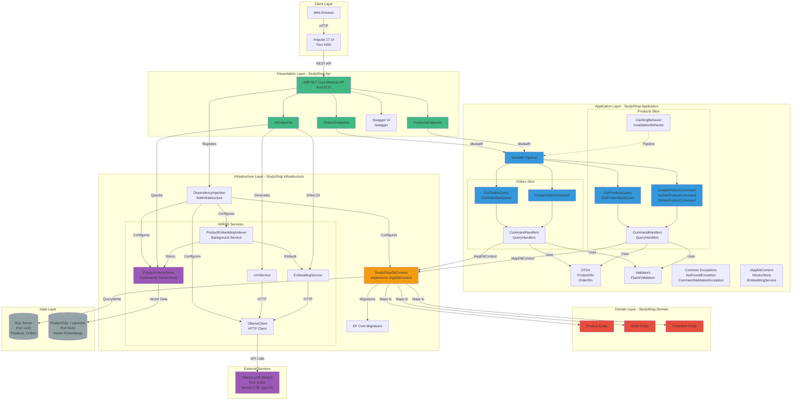

# StudyShop Architecture Documentation

## Overview

StudyShop follows **Clean Architecture** principles combined with the **Vertical Slices** pattern, providing a maintainable, testable, and scalable codebase.

## Architecture Diagram



## Layer Details

### 1. Domain Layer (`StudyShop.Domain`)

**Purpose**: Pure business entities with no dependencies.

**Contents**:
- `Models/Product.cs` - Product entity
- `Models/Order.cs` - Order entity  
- `Models/OrderItem.cs` - Order item entity

**Characteristics**:
- ✅ No dependencies on other layers
- ✅ Pure C# classes (POCOs)
- ✅ Contains business logic only (if needed)
- ✅ No frameworks (no EF Core, no MediatR)

### 2. Application Layer (`StudyShop.Application`)

**Purpose**: Business logic, use cases, and application interfaces.

**Contents**:
- **Features/** (Vertical Slices):
  - `Products/` - All product-related use cases
  - `Orders/` - All order-related use cases
- **DTOs/** - Data Transfer Objects
- **Validators/** - FluentValidation rules
- **Common/** - Shared exceptions and utilities
- **Data/** - `IAppDbContext` interface
- **Ai/** - AI service interfaces (`IVectorStore`, `IEmbeddingService`, `ILlmService`)

**Characteristics**:
- ✅ Depends only on Domain
- ✅ Defines interfaces (not implementations)
- ✅ Contains use cases (Commands/Queries)
- ✅ Handlers implement business logic
- ✅ Validation rules
- ✅ Pipeline behaviors (caching, etc.)

### 3. Infrastructure Layer (`StudyShop.Infrastructure`)

**Purpose**: External dependencies and implementations.

**Contents**:
- **Data/**:
  - `StudyShopDbContext` - EF Core DbContext (implements `IAppDbContext`)
  - EF Core configurations
- **Ai/**:
  - `OllamaClient` - HTTP client for Ollama
  - `EmbeddingService` - Generates embeddings
  - `LlmService` - LLM chat generation
  - `PostgresVectorStore` - pgvector implementation
  - `ProductEmbeddingIndexer` - Background service
- `DependencyInjection.cs` - Service registration

**Characteristics**:
- ✅ Implements Application interfaces
- ✅ Depends on Application (for interfaces)
- ✅ Depends on Domain (for entities)
- ✅ Contains external service clients
- ✅ Database access
- ✅ AI/ML integrations

### 4. Presentation Layer (`StudyShop.Api`)

**Purpose**: API endpoints and HTTP concerns.

**Contents**:
- **Endpoints/**:
  - `ProductsEndpoints.cs` - Product API routes
  - `OrdersEndpoints.cs` - Order API routes
  - `AiEndpoints.cs` - AI/RAG endpoints
- `Program.cs` - Startup and configuration

**Characteristics**:
- ✅ Depends on Application (uses MediatR, DTOs)
- ✅ Minimal API endpoints
- ✅ Swagger/OpenAPI generation
- ✅ CORS configuration
- ✅ Error handling

## Vertical Slices Pattern

Each feature is organized as a complete "slice" containing:

```
Features/
  Products/
    Commands/
      CreateProductCommand.cs
      CreateProductCommandHandler.cs
      UpdateProductCommand.cs
      UpdateProductCommandHandler.cs
      DeleteProductCommand.cs
      DeleteProductCommandHandler.cs
    Queries/
      GetProductsQuery.cs
      GetProductsQueryHandler.cs
      GetProductByIdQuery.cs
      GetProductByIdQueryHandler.cs
    Behaviors/
      QueryCachingBehavior.cs
      CacheInvalidationBehavior.cs
```

**Benefits**:
- ✅ All related code in one place
- ✅ Easy to find and modify
- ✅ Minimal coupling between slices
- ✅ Easy to add new features

## Dependency Flow

```
┌─────────────────┐
│  Presentation   │  (StudyShop.Api)
│   (API Layer)   │
└────────┬────────┘
         │ depends on
         ▼
┌─────────────────┐
│  Application    │  (StudyShop.Application)
│  (Use Cases)    │
└────────┬────────┘
         │ depends on
         ▼
┌─────────────────┐
│     Domain      │  (StudyShop.Domain)
│   (Entities)    │
└─────────────────┘
         ▲
         │ implements
┌────────┴────────┐
│ Infrastructure  │  (StudyShop.Infrastructure)
│  (External)     │
└─────────────────┘
```

## Data Flow Example: Create Product

```
1. HTTP POST /api/products
   ↓
2. ProductsEndpoints.MapPost()
   ↓
3. MediatR.Send(new CreateProductCommand { ... })
   ↓
4. CreateProductCommandHandler.Handle()
   ├─→ Validator.ValidateAsync()
   ├─→ new Product { ... }
   ├─→ IAppDbContext.Products.Add(product)
   └─→ IAppDbContext.SaveChangesAsync()
   ↓
5. StudyShopDbContext.SaveChangesAsync()
   ↓
6. SQL Server INSERT
   ↓
7. CacheInvalidationBehavior (clears cache)
   ↓
8. Returns ProductDto
```

## AI/RAG Flow: Semantic Search

```
1. HTTP POST /api/ai/search?q="laptops under $1000"
   ↓
2. AiEndpoints
   ├─→ IEmbeddingService.CreateEmbedding("laptops under $1000")
   │   └─→ OllamaClient.EmbedAsync()
   │       └─→ HTTP POST to Ollama /api/embeddings
   │           └─→ Returns float[1536] vector
   │
   └─→ IVectorStore.QueryProductsAsync(vector, topK: 5)
       └─→ PostgresVectorStore
           └─→ PostgreSQL query with pgvector cosine similarity
               └─→ Returns top 5 matching products
   ↓
3. Returns JSON with product matches and scores
```

## Testing Strategy

### Unit Tests (`StudyShop.Api.Tests/Unit/`)

Test handlers in isolation:
- Mock `IAppDbContext`
- Test business logic
- Verify validation

### Integration Tests (`StudyShop.Api.Tests/Integration/`)

Test API endpoints end-to-end:
- Use `TestApiFactory` with InMemory database
- Test HTTP requests/responses
- Verify complete flow

## Key Design Decisions

1. **Clean Architecture**: Separation of concerns, testability
2. **Vertical Slices**: Feature organization over technical layers
3. **CQRS**: Separate read/write models for scalability
4. **Interface-Based Design**: Application defines contracts, Infrastructure implements
5. **Minimal API**: Modern .NET 9 endpoint registration
6. **Local AI**: Ollama for embeddings, pgvector for storage

## Future Enhancements

- [ ] GraphQL endpoint
- [ ] Neo4j integration for graph queries
- [ ] Redis for distributed caching
- [ ] Event sourcing for audit trail
- [ ] Microservices extraction (if needed)
- [ ] OpenTelemetry for observability

