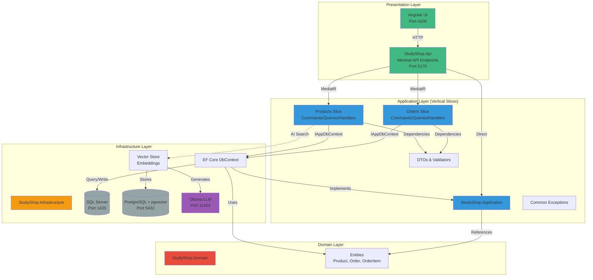

# StudyShop - Full-Stack Learning Project

A modern full-stack e-commerce demo showcasing **Clean Architecture** with **Vertical Slices**, **CQRS**, AI-powered semantic search (RAG), and automated code generation.

## 🎯 Project Goals

- **Backend**: .NET 9 Web API with Clean Architecture (Domain/Application/Infrastructure) + Vertical Slices + CQRS
- **AI/RAG**: Local LLM (Ollama) with semantic product search using pgvector
- **Frontend**: Angular 17+ with Material UI and auto-generated typed services
- **Architecture**: Clean Architecture principles with Vertical Slices for maintainability
- **Code Generation**: One-command script to regenerate TypeScript client from Swagger

## 🏗️ Architecture Overview

### Clean Architecture + Vertical Slices

The project follows **Clean Architecture** principles with **Vertical Slices** pattern:

```
StudyShop/
├── StudyShop.Domain/              # Core Business Entities (unchanged)
│   └── Models/
│       ├── Product.cs
│       ├── Order.cs
│       └── OrderItem.cs
│
├── StudyShop.Application/          # Business Logic & Use Cases
│   ├── Features/                   # Vertical Slices
│   │   ├── Products/
│   │   │   ├── Commands/          # CreateProduct, UpdateProduct, DeleteProduct
│   │   │   ├── Queries/           # GetProducts, GetProductById
│   │   │   └── Behaviors/         # Caching, Validation
│   │   └── Orders/
│   │       ├── Commands/          # CreateOrder
│   │       └── Queries/           # GetOrders, GetOrderById
│   ├── DTOs/                      # Data Transfer Objects
│   ├── Validators/                # FluentValidation rules
│   ├── Common/                    # Exceptions, shared logic
│   └── Data/                      # IAppDbContext interface
│
├── StudyShop.Infrastructure/      # External Dependencies (unchanged)
│   ├── Data/
│   │   └── StudyShopDbContext.cs  # EF Core DbContext (implements IAppDbContext)
│   ├── Ai/
│   │   └── OllamaAndVector.cs     # Ollama client, pgvector store
│   └── DependencyInjection.cs     # Service registration
│
├── StudyShop.Api/                 # Presentation Layer (Minimal API)
│   ├── Endpoints/                 # API endpoint mappings
│   │   ├── ProductsEndpoints.cs
│   │   ├── OrdersEndpoints.cs
│   │   └── AiEndpoints.cs        # /ai/search, /ai/answer
│   └── Program.cs                 # Startup & configuration
│
├── StudyShop.Api.Tests/           # Integration & Unit Tests
│   ├── Integration/
│   └── Unit/
│
└── studyshop-ui/                  # Angular 17+ Frontend
    ├── src/app/
    │   ├── pages/                  # ProductsPage, OrdersPage
    │   └── api/                     # Generated TypeScript client
    └── package.json
```

### Architecture Diagram



### Dependency Flow

```
Presentation (API)
    ↓ depends on
Application (Business Logic)
    ↓ depends on
Domain (Entities)
    ↑ implements
Infrastructure (EF, AI, External Services)
```

**Key Principles:**
- ✅ **Domain** has no dependencies (pure business logic)
- ✅ **Application** depends only on Domain (defines interfaces)
- ✅ **Infrastructure** implements Application interfaces
- ✅ **Presentation** depends on Application (uses MediatR, DTOs)
- ✅ **Vertical Slices** organize features by business capability (Products, Orders, AI)

## 🚀 Quick Start

### Prerequisites

- **.NET 9 SDK**: [Download](https://dotnet.microsoft.com/download/dotnet/9.0)
- **Node.js 18+**: [Download](https://nodejs.org/)
- **Angular CLI**: `npm install -g @angular/cli`
- **Docker Desktop** (for AI/RAG features)

### Step 1: Start with Docker (Recommended)

```bash
# From project root
docker compose up -d --build

# Pull Ollama models (first time only)
curl -X POST http://localhost:11434/api/pull -d '{"name":"llama3.2:3b"}'
curl -X POST http://localhost:11434/api/pull -d '{"name":"bge-m3"}'
```

This starts:
- ✅ SQL Server (port 1433)
- ✅ PostgreSQL + pgvector (port 5432)
- ✅ Ollama LLM (port 11434)
- ✅ .NET 9 API (port 5170)
- ✅ Angular UI (port 4200)

### Step 2: Start Locally (Alternative)

#### Backend
```bash
cd StudyShop.Api
dotnet restore
dotnet run
# API: http://localhost:5170
# Swagger: http://localhost:5170/swagger
```

#### Frontend
```bash
cd studyshop-ui
npm install
npm run gen:api  # Generate TypeScript client
npm start
# UI: http://localhost:4200
```

## 🧠 AI/RAG Features

### Semantic Search

- **Natural Language Queries**: "Find laptops under $1000"
- **Vector Similarity**: Uses pgvector for semantic matching
- **Embeddings**: Generated by Ollama (bge-m3 model)
- **Real-time Indexing**: Products automatically embedded on create/update

### Endpoints

```
POST /api/ai/search?q=laptops       # Semantic product search
POST /api/ai/answer                 # RAG-based Q&A
```

### Configuration

Edit `appsettings.json`:
```json
{
  "LLM": {
    "BaseUrl": "http://localhost:11434",
    "ChatModel": "llama3.2:3b",
    "EmbeddingModel": "bge-m3"
  },
  "VectorStore": {
    "ConnectionString": "Host=postgres;Port=5432;Database=studyshop;Username=postgres;Password=postgres"
  }
}
```

## 📚 Key Features

### Backend (.NET 9)

- ✅ **Clean Architecture** - Domain/Application/Infrastructure separation
- ✅ **Vertical Slices** - Features organized by business capability
- ✅ **CQRS Pattern** - Commands (writes) and Queries (reads) separated
- ✅ **MediatR** - Mediator pattern for CQRS
- ✅ **Minimal API** - Modern .NET 9 endpoint registration
- ✅ **Swagger/OpenAPI v3** - Auto-generated API docs
- ✅ **EF Core 9.0** - SQL Server with migrations
- ✅ **FluentValidation** - Server-side validation
- ✅ **Caching** - Memory cache with invalidation behaviors
- ✅ **AI/RAG** - Semantic search with Ollama + pgvector

### API Endpoints

```
Products:
GET    /api/products                # List (with search/pagination)
GET    /api/products/{id}           # Get by ID
POST   /api/products                # Create
PUT    /api/products/{id}           # Update
DELETE /api/products/{id}           # Delete

Orders:
GET    /api/orders                  # List all
GET    /api/orders/{id}             # Get by ID
POST   /api/orders                  # Create (validates stock)

AI:
POST   /api/ai/search?q=...         # Semantic search
POST   /api/ai/answer               # RAG Q&A
```

### Frontend (Angular 17)

- ✅ **Standalone Components** - Modern Angular
- ✅ **Angular Material** - UI components
- ✅ **Auto-generated Client** - TypeScript services from Swagger
- ✅ **Semantic Search UI** - AI-powered product discovery
- ✅ **Reactive Forms** - Client-side validation

## 🧪 Testing

### Run Tests

```bash
# From project root
dotnet test StudyShop.Api.Tests/StudyShop.Api.Tests.csproj
```

### Test Structure

- **Integration Tests**: Test API endpoints end-to-end
- **Unit Tests**: Test MediatR handlers in isolation

## 📖 Learning Points

1. **Clean Architecture**
   - Domain layer is pure business logic (no dependencies)
   - Application defines use cases and interfaces
   - Infrastructure implements external concerns
   - Presentation (API) orchestrates requests

2. **Vertical Slices**
   - Features grouped by business capability
   - Each slice contains Commands, Queries, Handlers, Validators
   - Easy to add new features without touching existing code

3. **CQRS Pattern**
   - Separates read (Queries) from write (Commands) operations
   - Enables independent scaling and optimization
   - Clear separation of concerns

4. **AI/RAG Implementation**
   - Local LLM (Ollama) for embeddings and chat
   - Vector database (pgvector) for semantic search
   - Automatic product indexing on changes

## 🔧 Configuration

### Database Connection

Edit `StudyShop.Api/appsettings.json`:
```json
{
  "ConnectionStrings": {
    "DefaultConnection": "Server=localhost,1433;Database=StudyShopDb;User Id=sa;Password=YourStrong@Passw0rd;TrustServerCertificate=True"
  }
}
```

### Vector Store (PostgreSQL)

```json
{
  "VectorStore": {
    "ConnectionString": "Host=localhost;Port=5432;Database=studyshop;Username=postgres;Password=postgres"
  }
}
```

## 📝 Documentation

- **[ARCHITECTURE.md](ARCHITECTURE.md)** - Detailed architecture overview
- **[SWAGGER-EXPORT.md](SWAGGER-EXPORT.md)** - API code generation guide
- **[DOCKER.md](DOCKER.md)** - Docker deployment guide
- **[MIGRATION-TO-DOTNET9.md](MIGRATION-TO-DOTNET9.md)** - .NET 9 migration notes

## 🎓 Next Steps

- [ ] Add GraphQL endpoint
- [ ] Implement Neo4j for relationship queries
- [ ] Add JWT authentication
- [ ] Add integration tests for AI endpoints
- [ ] Implement Redis for distributed caching
- [ ] Add OpenTelemetry for observability

## 📄 License

This is a learning project. Feel free to use and modify as needed.
