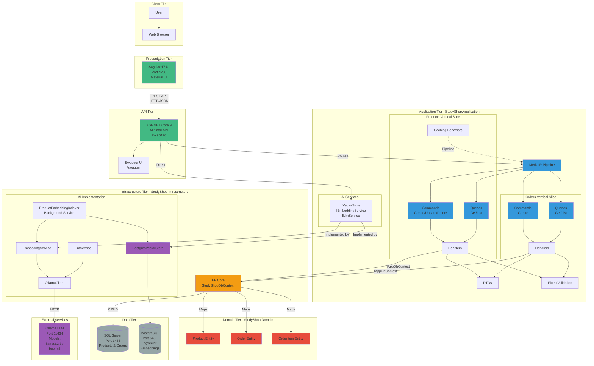
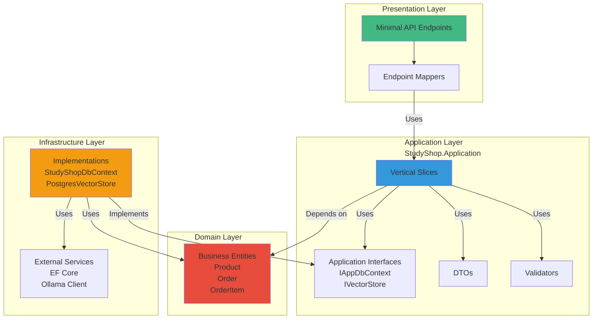
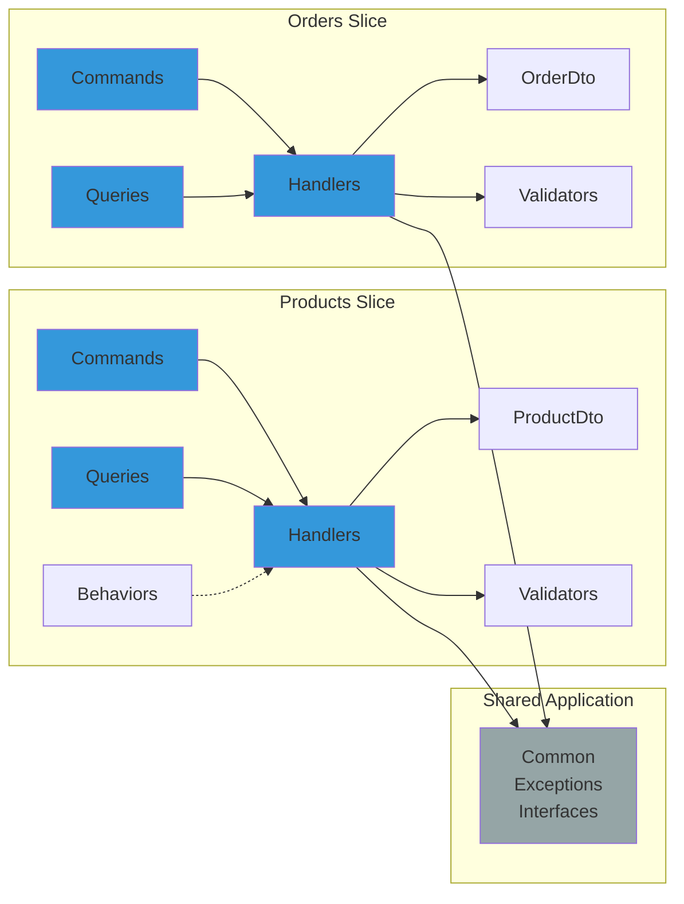
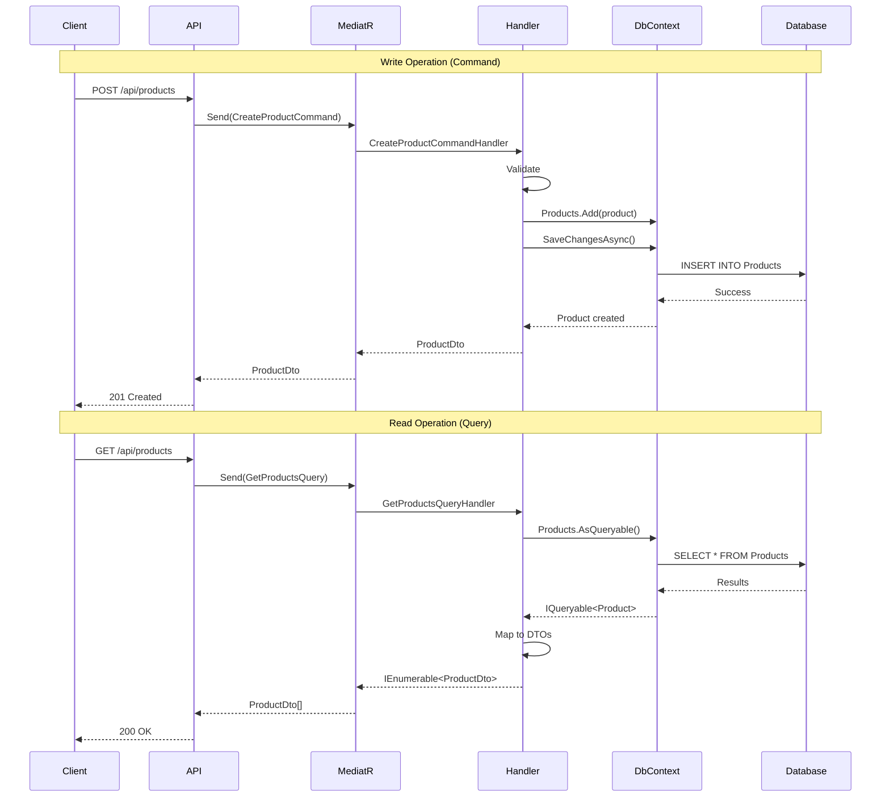
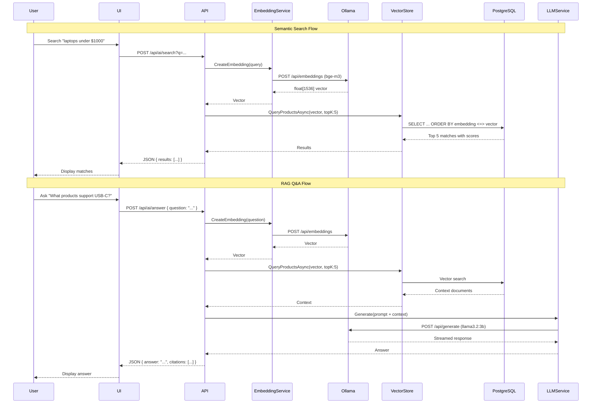
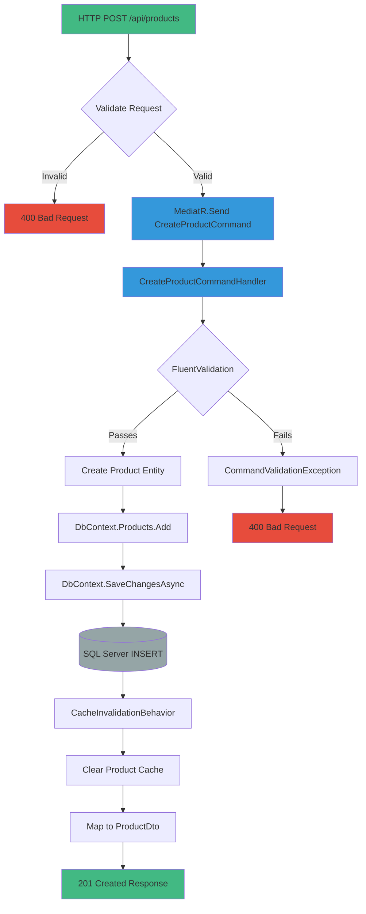
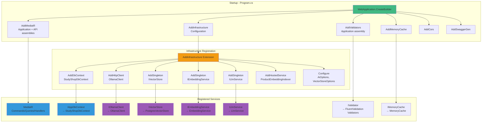
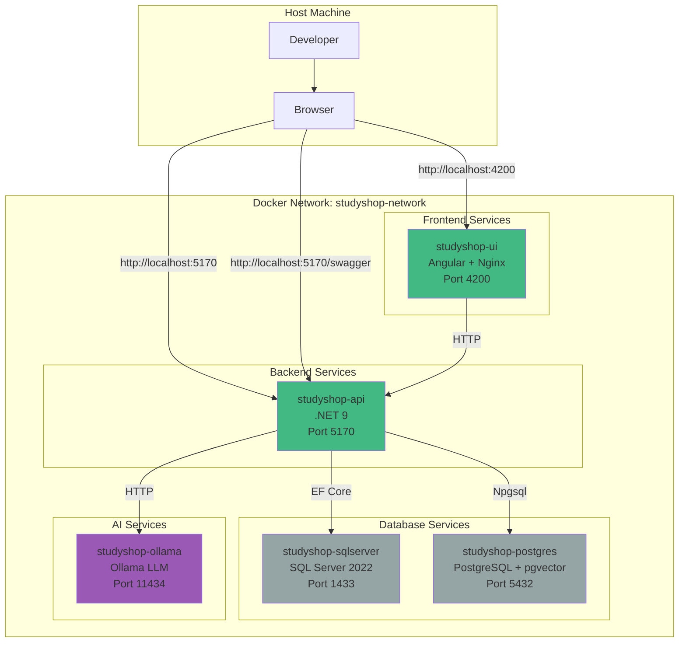

# StudyShop System Architecture Diagrams

## Complete System Overview

## Clean Architecture Layers

## Vertical Slices Pattern

## CQRS Flow

## AI/RAG Flow

## Data Flow: Create Product

## Dependency Injection Container

## Docker Services Architecture

## Component Interaction Matrix

| Component | Depends On | Used By |
|-----------|------------|---------|
| **StudyShop.Domain** | None | Application, Infrastructure |
| **StudyShop.Application** | Domain | API, Tests |
| **StudyShop.Infrastructure** | Domain, Application | API |
| **StudyShop.Api** | Application, Infrastructure | Tests, UI |
| **Angular UI** | API (via HTTP) | User |

## Technology Stack

### Backend
- **.NET 9** - Runtime and SDK
- **ASP.NET Core 9** - Web framework
- **EF Core 9** - ORM
- **MediatR 12.4** - CQRS mediator
- **FluentValidation 11.9** - Validation
- **Swashbuckle 6.8** - Swagger generation

### AI/RAG
- **Ollama** - Local LLM runtime
- **pgvector** - Vector similarity search
- **PostgreSQL 16** - Vector database

### Frontend
- **Angular 17** - Framework
- **Angular Material** - UI components
- **TypeScript** - Language
- **openapi-typescript-codegen** - API client generation

### Infrastructure
- **Docker** - Containerization
- **SQL Server 2022** - Primary database
- **PostgreSQL 16** - Vector database
- **Nginx** - Web server (UI)

## Port Allocation

| Service | Port | Protocol | Purpose |
|---------|------|----------|---------|
| Angular UI | 4200 | HTTP | Frontend application |
| API | 5170 | HTTP | REST API & Swagger |
| SQL Server | 1433 | TCP | Product/Order data |
| PostgreSQL | 5432 | TCP | Vector embeddings |
| Ollama | 11434 | HTTP | LLM service |

## Data Flow Summary

1. **User Request** → Angular UI (Port 4200)
2. **API Call** → StudyShop.Api (Port 5170)
3. **MediatR** → Application Layer (Commands/Queries)
4. **Handler** → Infrastructure (DbContext, AI Services)
5. **Database** → SQL Server (entities) or PostgreSQL (vectors)
6. **Response** → DTOs → JSON → UI

